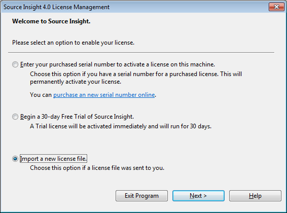

# source_insight_4
===============================================
使用流程
-------------------
- **`安装流程`**
	
	直接点击 sourceinsight_4.0.86.0-setup.exe ，
	然后用sourceinsight4.exe 替换掉安装目录中的sourceinsight4.exe，

- **`破解流程`**
	
	运行替换后的二进制文件sourceinsight4.exe,按着如下提示进行破解:
	在弹出的对话框中选择第三项并导入文件 si4.pediy.lic, 点击Next 即可破解
	

- **` 卸载流程`**
	
	1. “win ”+ R  或者  “开始” -> “运行”，输入“regedit”，回车；
	2. 在弹出的注册表管理器中，选择“编辑”-> “查找”->“source insight”，或按照下述路径展开：HKEY_CURRENT_USER -> software -> Source Dynamics -> Source Insight
	3. 将该项下面的source insight 需要清除的对应版本项目选中，右键“删除“
